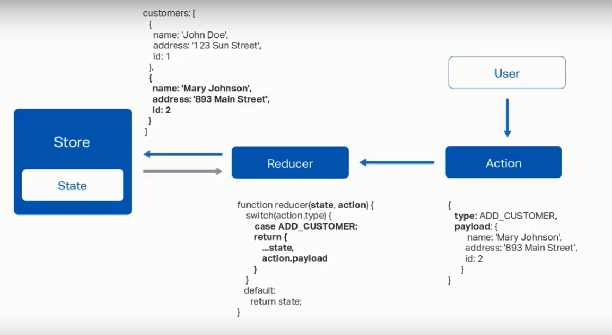

# Configuración NGRX

como ejemplo tenemos el siguiente modelo de customer

```js
export interface Customer {
  id?: number;
  name: string;
  phone: string;
  address: string;
  membership: string;
}
```

Dentro del modulo de Customer se create la carpeta llamada 'state', la cual contendra todo lo relacionado
con el stado del customer

Dentro de la carpete state se crean los siguientes archivos 

- customer.actions.ts : el cual contendra todas las posibles acciones que se pueden ejecutar sobre un customer.

- customer.reducer.ts : contiene los metodos me manejan las acciones disparadas por o hacia el customer , dependiendo de la accion el reducer returna el nuevo state del customer.




# Configuración en el modulo de customer

```js
...

import { StoreModule } from "@ngrx/store";
import { CustomerRecuder } from "./state/customer.reducer";


const customerRoutes: Routes = [{ path: "", component: CustomersComponent }];

@NgModule({
  declarations: [
    ...
  ],
  imports: [
    CommonModule,
    RouterModule.forChild(customerRoutes),
    StoreModule.forFeature("customer", CustomerRecuder)// el primero es la parte que manejara y el segundo el reducer que estara a la escucha
  ]
})
export class CustomersModule { }
```


- En el customer.reducer.ts

```js
import { Action } from '@ngrx/store';

const initialState = {
    customers:[
        {
            name : "John Doe",
            phone : "4654564564",
            address: "st",
            membership: "Platinum",
            id: 1
        }
    ],
    loading: false,
    loaded: true
}

// el primer parametro es el estado del objeto customer y el segundo es la acion que se ejecuta
export function CustomerReducer(state = initialState, action:Action){
    switch (action.type) {
        case "LOAD_CUSTOMER":{
            return {
                ...state,
                loading: true,
                loaded: false
            }
        }
                                    
        default:
            return state;
    }
}
```


- Con la configuracion previa ya podriamos ejecutar una accion desde un compnente y estar a la escucha de los eventos del store

```js
// Ejemplo desde el componente de customer-list

export class CustomersListComponent implements OnInit {

  customers:Customer[];

  constructor(private store: Store<any>) { }

  ngOnInit() {
    // hace un dispatch de la accion LOAD_CUSTOMER
    this.store.dispatch({type: 'LOAD_CUSTOMER'})

    // Se suscibe a los eventos del store y llena la lista
    this.store.subscribe(state => {      
      this.customers = state.customer.customers
    })
  }

}

```


