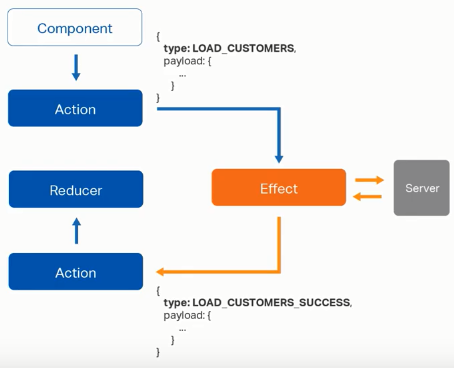

# Effects

Los effects son un modelo de effects secundarios impulsados ​​por RxJS para Store . Los effects usan flujos para proporcionar nuevas fuentes de acciones para reducir el estado en función de interacciones externas, como solicitudes de red, mensajes de socket web y eventos basados ​​en el tiempo.

En una aplicación angular basada en servicios, los componentes son responsables de interactuar con recursos externos directamente a través de los servicios. En cambio, los effects proporcionan una forma de interactuar con esos servicios y aislarlos de los componentes. Los effects son donde maneja tareas tales como obtener datos, tareas de larga duración que producen múltiples eventos y otras interacciones externas donde sus componentes no necesitan un conocimiento explícito de estas interacciones.




# Implementacion 

- dentro del proyecto de prueba customers/state/cusotmer.effects.ts
```js
import { Injectable } from '@angular/core';

import { Actions, Effect, ofType } from "@ngrx/effects";
import { Action } from "@ngrx/store";
import { Observable, of } from "rxjs";
import { map, mergeMap, catchError } from "rxjs/operators";

import { CustomerService } from "../customer.service";
import * as customerActions from './customer.actions';
import { Customer } from "../customer.model";

@Injectable()
export class CustomerEffect {
    constructor(
        private actions$: Actions,
        private customerService: CustomerService
    ){}


    @Effect()
    loadCustomer$: Observable<Action> = this.actions$.pipe(
        // Filtra el tipo de action
        ofType<customerActions.LoadCustomers>(
            customerActions.CustomerActionTypes.LOAD_CUSTOMERS
        ),
        mergeMap((actions: customerActions.LoadCustomers)=>
            // LLama el servicio
            this.customerService.getCustomers().pipe(
                map(
                    (customers: Customer[])=>
                    // dispara un evento de success
                    new customerActions.LoadCustomersSuccess(customers)
                ),
                /* si se presenta un error , dispara un evento de fail pasando el error */
                catchError(err => of (new customerActions.LoadCustomersFail(err)))
            )
        )
    )
}
```

- Luego se debe agregar al modulo del fueature en este caso customerModule

```js
import { EffectsModule, Actions } from "@ngrx/effects";
import { CustomerEffect } from "./state/customer.effects";

const customerRoutes: Routes = [
  { path: "", component: CustomersComponent }
];

@NgModule({
  declarations: [
    CustomersComponent, 
    CustomersAddComponent, 
    CustomersEditComponent, 
    CustomersListComponent
  ],
  imports: [
    CommonModule,
    RouterModule.forChild(customerRoutes),
    StoreModule.forFeature("customer", customerReducer),

    // Agregar el servicio de Effect
    EffectsModule.forFeature([CustomerEffect])
  ]
})
export class CustomersModule { }
```

- Agregar al app-module

```js
import { EffectsModule } from '@ngrx/effects';

@NgModule({
  declarations: [
   ...
  ],
  imports: [
    BrowserModule,
    AppRoutingModule,
    HttpClientModule,
    StoreModule.forRoot({}),

    // Agregar Effects
    EffectsModule.forRoot([])
  ],
  providers: [],
  bootstrap: [AppComponent]
})
export class AppModule { }
```


- Ahora podremo probarlo desde un componente

```js
import * as customerActions from "../state/customer.actions";

@Component({
  selector: 'app-customers-list',
  templateUrl: './customers-list.component.html',
  styleUrls: ['./customers-list.component.css']
})
export class CustomersListComponent implements OnInit {

  customers:Customer[];

  constructor(private store: Store<any>) { }

  ngOnInit() {
    this.store.dispatch(new customerActions.LoadCustomers());
    this.store.subscribe(state => {      
      this.customers = state.customer.customers
    })
  }
```