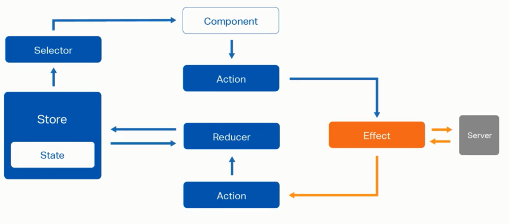

# Selectors

Los selectores (selectors) como su nombre indica ayudan a seleccionar el tipo de objeto 
desde el store.

En los ejemplos anteriores la suscripcion de eventos se realizo al State de la aplicacion completa
pero lo correcto seria suscribirse solo al tipo de eventos que nos interesa como los eventos provenientes de Customer




# Crear un Selector

- customer/state/customer.reducer.ts ,al final de l archivo

```js
import { createFeatureSelector, createSelector } from "@ngrx/store";
import { CustomerState } from './customer.reducer';


// Obtener el State requerido
const getCustomerFeatureState = createFeatureSelector<CustomerState>(
    "customers"
)
 
// Selectors de propiedades especificas que se necesitan
export const getCustomers = createSelector(
    // feature
    getCustomerFeatureState ,

    //propiedad especifica que queremos obtener
    (state: CustomerState) => state.customers
)

export const getCustomersLoading = createSelector(    
    getCustomerFeatureState ,   
    (state: CustomerState) => state.loading
)


export const getCustomersLoaded = createSelector(    
    getCustomerFeatureState ,   
    (state: CustomerState) => state.loaded
)

export const getError = createSelector(    
    getCustomerFeatureState ,   
    (state: CustomerState) => state.error
)
```

- Ahora desde el componente se puede suscribir a los Selectors

```js
import { Store, select } from '@ngrx/store';
import { Customer } from '../customer.model';
import { Observable } from "rxjs";
import * as customerActions from "../state/customer.actions";
import * as fromCustomer from "../state/customer.reducer";


@Component({
  selector: 'app-customers-list',
  template: `
         <tr *ngFor="let customer of (customers$ | async) ">
            <th scope="row">{{customer.name}}</th>
            <td>{{customer.phone}}</td>
            <td>{{customer.address}}</td>
            <td>{{customer.membership}}</td>           
        </tr>
  `,
  styleUrls: ['./customers-list.component.css']
})
export class CustomersListComponent implements OnInit {

  customers$: Observable<Customer[]>;

  loaded$:  Observable<boolean>;

  constructor(private store: Store<fromCustomer.AppState>) { }

  ngOnInit() {
    this.store.dispatch(new customerActions.LoadCustomers());
    this.customers$ = this.store.pipe(
      select(fromCustomer.getCustomers)
    )
  }

}


```